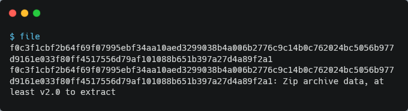
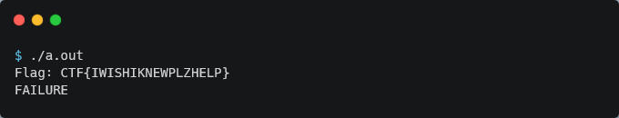
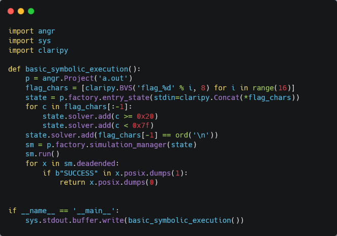

# Beginner

**Problem Description:**

> Dust off the cobwebs, let's reverse!<br>
>
> [Attachment](./f0c3f1cbf2b64f69f07995ebf34aa10aed3299038b4a006b2776c9c14b0c762024bc5056b977d9161e033f80ff4517556d79af101088b651b397a27d4a89f2a1)

## Solution

Since, the attachment file name was just a hash, I ran `file` to figure out what it is:

<center></center>

Apparently, it is a zip file containing a single file [a.out](./a.out). Unzipping and running `a.out`:

<center></center>

There was absolutely no need to call me a `FAILURE`... :cry: 

Anyways, I decided to believe in GDB:

```assembly
(gdb) disas main
Dump of assembler code for function main:
   0x0000000000001080 <+0>:     push   r12
   0x0000000000001082 <+2>:     lea    rdi,[rip+0xf7b]        # 0x2004
   0x0000000000001089 <+9>:     xor    eax,eax
   0x000000000000108b <+11>:    push   rbp
   0x000000000000108c <+12>:    sub    rsp,0x28
   0x0000000000001090 <+16>:    call   0x1050 <printf@plt>
   0x0000000000001095 <+21>:    mov    r12,rsp
   0x0000000000001098 <+24>:    xor    eax,eax
   0x000000000000109a <+26>:    lea    rbp,[rsp+0x10]
   0x000000000000109f <+31>:    mov    rsi,r12
   0x00000000000010a2 <+34>:    lea    rdi,[rip+0xf62]        # 0x200b
   0x00000000000010a9 <+41>:    call   0x1060 <__isoc99_scanf@plt>
   0x00000000000010ae <+46>:    movdqa xmm0,XMMWORD PTR [rsp]
   0x00000000000010b3 <+51>:    mov    rsi,rbp
   0x00000000000010b6 <+54>:    mov    rdi,r12
   0x00000000000010b9 <+57>:    mov    edx,0x10
   0x00000000000010be <+62>:    pshufb xmm0,XMMWORD PTR [rip+0x2fa9]        # 0x4070 <SHUFFLE>
   0x00000000000010c7 <+71>:    paddd  xmm0,XMMWORD PTR [rip+0x2f91]        # 0x4060 <ADD32>
   0x00000000000010cf <+79>:    pxor   xmm0,XMMWORD PTR [rip+0x2f79]        # 0x4050 <XOR>
   0x00000000000010d7 <+87>:    movaps XMMWORD PTR [rsp+0x10],xmm0
   0x00000000000010dc <+92>:    call   0x1030 <strncmp@plt>
   0x00000000000010e1 <+97>:    test   eax,eax
   0x00000000000010e3 <+99>:    jne    0x1100 <main+128>
   0x00000000000010e5 <+101>:   mov    rsi,QWORD PTR [rip+0x2f94]        # 0x4080 <EXPECTED_PREFIX>
   0x00000000000010ec <+108>:   mov    edx,0x4
   0x00000000000010f1 <+113>:   mov    rdi,rbp
   0x00000000000010f4 <+116>:   call   0x1030 <strncmp@plt>
   0x00000000000010f9 <+121>:   mov    r12d,eax
   0x00000000000010fc <+124>:   test   eax,eax
   0x00000000000010fe <+126>:   je     0x111d <main+157>
   0x0000000000001100 <+128>:   lea    rdi,[rip+0xf11]        # 0x2018
   0x0000000000001107 <+135>:   mov    r12d,0x1
   0x000000000000110d <+141>:   call   0x1040 <puts@plt>
   0x0000000000001112 <+146>:   add    rsp,0x28
   0x0000000000001116 <+150>:   mov    eax,r12d
   0x0000000000001119 <+153>:   pop    rbp
   0x000000000000111a <+154>:   pop    r12
   0x000000000000111c <+156>:   ret
   0x000000000000111d <+157>:   lea    rdi,[rip+0xeec]        # 0x2010
   0x0000000000001124 <+164>:   call   0x1040 <puts@plt>
   0x0000000000001129 <+169>:   jmp    0x1112 <main+146>
End of assembler dump.
```

The program and its disassembly look fairly straightforward:

1. We are prompted to enter the flag and our input is read
2. The input is copied onto the SSE register `xmm0`
3. Three SIMD operations are performed (shuffle, add, and then xor)
4. If the resulting string is the same as the original string and it begins with the `EXPECTED_PREFIX` (`CTF{`) we succeed

**Note:** Through the `scanf` format specifier `%15s` (can be found using `x/s 0x200b`), we can tell the flag must be 15 bytes max (without the null terminator).

I'd been wanting to try angr for some time, and this felt like something angr could easily solve. So, I quickly whipped up the following [script](./solve.py) based on prior examples:



Running the script, (and ignoring a few warnings :P) we get: 

```
CTF{S1MDf0rM3!}
```

