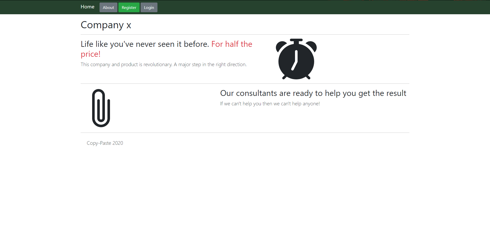
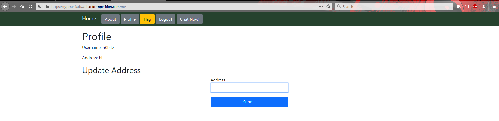
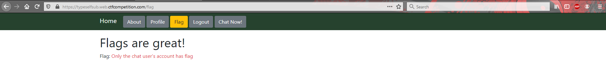
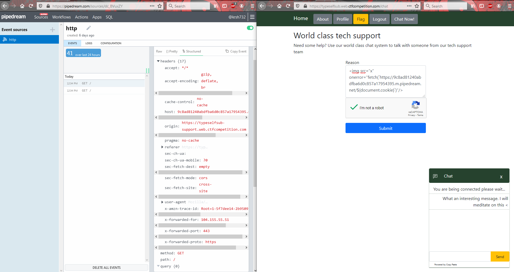
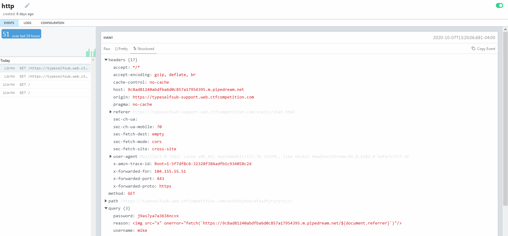
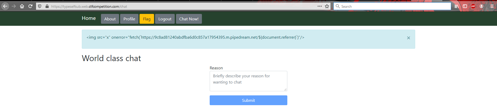
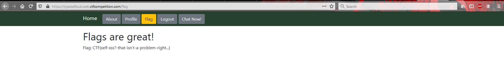

# Tech Support

**Problem Description:**

> Try chatting with tech support about getting a flag.<br>
>
> Note: We have received multiple reports of exploits not working  remotely, but we triple checked and concluded that the bot is working properly.<br>
>
> [https://typeselfsub.web.ctfcompetition.com/](https://typeselfsub.web.ctfcompetition.com/)

## Solution

**Note:** I solved this challenge through an easier unintended way. I recommend people read the intended solution [here](https://github.com/0xParrot/writeups/tree/master/GoogleCtfQuals2020/web/techsupport) and/or view the [author's exploit](https://github.com/google/google-ctf/blob/master/2020/quals/web-typeselfsub/exploit.txt) instead of the following.

Since there were no attachments provided, I went ahead and visited [https://typeselfsub.web.ctfcompetition.com/](https://typeselfsub.web.ctfcompetition.com/): 

Both the about and home page were uninteresting, so I went ahead and made myself an account. A few new menu items appeared:



**Note:** A self-xss is possible using the address field, and is used in the intended solution.

`Flag` looked enticing, so I took a look at it:



I realized that I should probably be stealing the credentials of the chat user, and decided to go ahead and have a chat:



I noticed a few interesting things at this point:

- The reason box was obviously xss-able

- Both me and the chat user made a request to my request-bin

- The chat user didn't send any cookies

- The chat bot request came from another sub-domain: https://typeselfsub-support.web.ctfcompetition.com

At this point, I pointlessly spammed a few different payloads, ie:

```html
<form action="https://typeselfsub.web.ctfcompetition.com/me" method="POST">
    <input type="hidden" name="address" value="" />
</form>

```

None of them really got me anywhere, they would seem to work on my end, but the chat user's address didn't seem to change. Eventually, I tried the following:

```html

```

It must have been my lucky day, cause I saw the following:



With a suspicious looking URL like:

```
https://typeselfsub.web.ctfcompetition.com/asofdiyboxzdfasdfyryryryccc?password=j9as7ya7a3636ncvx&reason=&username=mike
```

I couldn't resist taking a visit:



Nothing appeared to change much, but I decided to visit `/flag`:



Guess I got lucky! :smile: